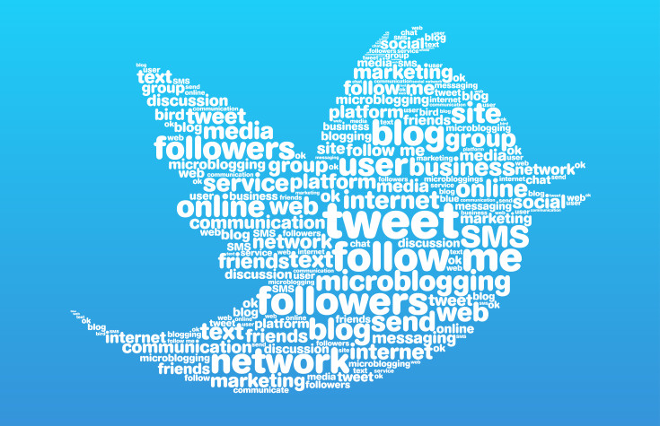

# Twitter airline sentiment project

 

Using natural language processing algorithms to classify twitters from travellers of six different US airline companies as positive, negative and neutral.

I have compared Multinomial Naive Bayes, Logistic Regression and Support Vector Classifier using their default hyperparameters and locally deployed the best model to be used in raw tweets. 

The dataset is available in [kaggle.com](https://www.kaggle.com/crowdflower/twitter-airline-sentiment) 